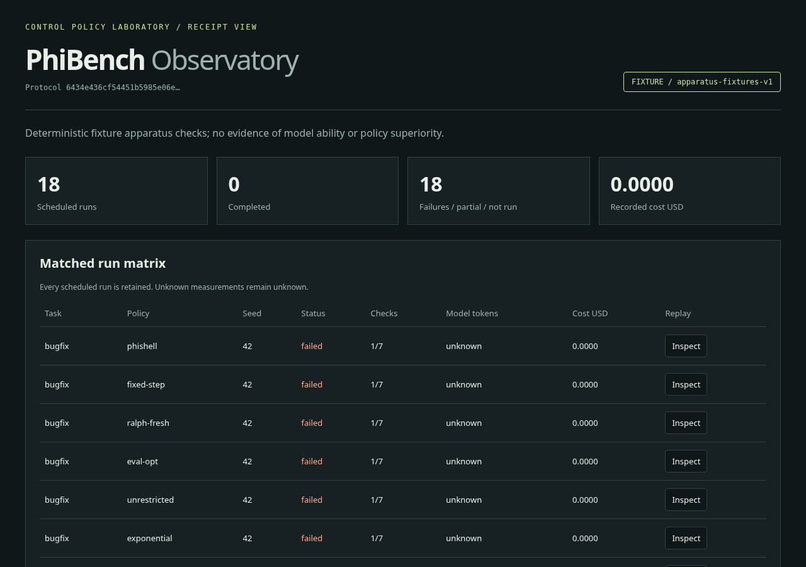

# PhiBench

**Compare coding-agent control policies with isolated execution and receipts you can replay.**



PhiShell is one treatment. Fixed-step, Ralph fresh-context, eval-opt,
unrestricted and exponential use the same tasks, tools, provider, evaluator
and resource ceilings. The variable is how development is paced, repaired and
remembered. Every scheduled run remains in the report, including failures,
interruption and unavailable providers.

The screenshot is a **deterministic null fixture** with real Python test
execution. It is an apparatus check, not model-performance evidence. Real-model
experiments for this release are **NOT RUN**. No policy superiority is claimed.

## First success

Execution needs Linux x86_64, Python 3.11+, distribution `/usr/bin/python3`,
Bubblewrap 0.12.0+ (`bwrap`), util-linux (`prlimit`), and permitted user namespaces
and seccomp. Use a distribution or upstream installation providing that version;
older distro packages are rejected. The Python package has **zero runtime dependencies**.
CI uses Ubuntu 22.04 with a checksum-pinned upstream Bubblewrap build. Some hosts
restrict namespace capabilities; `doctor` probes actual isolated execution and
fails closed when unavailable. Installation never changes host security settings.
ARM64 is untested; macOS and Windows cannot execute the sandbox.

Clone the public repository, then install from its checkout:

```sh
git clone https://github.com/bohselecta/corgi-phibench.git
cd corgi-phibench
python3 -m venv .venv
.venv/bin/python -m pip install .
.venv/bin/phibench doctor
.venv/bin/phibench demo --out experiment
.venv/bin/phibench verify experiment
```

Open `experiment/observatory.html` in a browser. It is self-contained, works
offline and makes no external requests. The success fixture executes 18 runs
(three task classes × six policies), compares real outputs with a trusted
oracle, and produces retained snapshots, test traces, context measurements
and patches. Its scripted provider knows the demo solutions and does not obey
frontiers; it tests scheduling and plumbing, never scientific differences.

For an offline checkout without pip, every command also works as
`python3 -m phibench …`. A missing sandbox fails closed; replay still works.

## Use the laboratory

```sh
phibench methods
phibench run --task feature --method phishell --out one-run
phibench replay one-run
phibench demo --scenario null --out null-experiment
phibench report null-experiment
phibench observe null-experiment --out null-observatory.html
phibench validate-method examples/bounded-method.yaml
phibench demo --method-file examples/bounded-method.yaml --out custom-experiment
```

Each output directory must be new. Existing experiments are never overwritten.
`demo --scenario regression`, `crash` and `timeout` exercise explicit fixture
failure paths. These are labeled fixtures, not simulated model evidence.
`replay` verifies the journal and derives metrics without rerunning a model;
`verify` actually reevaluates the saved final code in a fresh sandbox. A failed
run can have a passing final artifact after rollback; its run status still
remains failed.

If execution is killed or interrupted, inspect the retained run, then use:

```sh
phibench recover experiment/run-000-00-00
phibench report experiment
```

Recovery refuses an active writer, preserves a torn tail, and finalizes an
interrupted receipt. It does not resume inference or quietly start another
trial. Create and preregister a separate experiment for a retry.

## What changes between policies

| Policy | Frontier | Failure | Context |
|---|---|---|---|
| PhiShell | 1, 1, 2, 3, 5, … | Fibonacci split, queue remainder, restore last green | Two observations |
| Fixed-step | Five obligations | Retry, restore green | Full history within context ceiling |
| Ralph fresh-context | Two obligations | Retry, restore green | Fresh call with persistent progress |
| Eval-opt | Four obligations | Edit-disabled critique, targeted optimization, restore green | Full history and last critique |
| Unrestricted | All remaining obligations | Retry without rollback | Full history within context ceiling |
| Exponential | 1, 2, 4, 8, … | Halve, queue remainder, restore green | Two observations |

All policies share the same hard ceilings. “Unrestricted” describes scheduling,
not access to the host or unlimited resource spending. Critique calls consume
the same call and token budgets as implementation calls.

## Custom tasks, methods and providers

The Python API exposes `Task`, `Method`, `Budget`, `run` and `experiment`.
`--task-file` accepts a versioned JSON task for `run` or `demo`. Its expected
values remain in the trusted runner; the builder receives goals and obligation
descriptions, not oracle answers. Keep genuine held-out tasks outside
calibration, and use the same task file with `verify --task-file`.

See [the research protocol](docs/PROTOCOL.md), [interfaces and task format](docs/ARCHITECTURE.md),
[MDL grammar](docs/MDL.md), and [execution boundaries](SECURITY.md).

An OpenAI-compatible chat-completion adapter is available behind
`--endpoint`, `--model`, `--authorize-runtime`, explicit token/cost ceilings and
input/output prices. Authorization is mandatory before any request. Credentials
come from `PHIBENCH_API_KEY` and are never intentionally recorded. Provider
accounting requires reported token counts; configured prices yield estimated
cost, not an invoice. Live interoperability and model performance are **NOT RUN**;
transport tests do not establish either. This release's default budget is $0.
The adapter requires the POSIX main thread to enforce a total request deadline;
it refuses an existing active alarm. Provider and run ceilings both apply, using
the smaller remaining authorization.
Use a direct endpoint: HTTP redirects are rejected before another request.

## Verification and limits

```sh
python3 -m unittest discover -s tests -v
python3 tests/acceptance.py
```

The adversarial suite exercises traversal, symlinks, read-only execution,
host/judge concealment, stripped environment, network/fork denial, memory,
scratch/output limits, budgets, regression rollback, corrupted receipts,
interruption and honest unknown states. [Verification notes](docs/VERIFICATION.md)
state exactly what was checked.

Receipts are hash chained for corruption/tamper detection; they are not signed
attestations. Unknown token usage stays `null`; fixture context is measured in
bytes. There is no inferred productive-token ratio, causal effect estimate,
statistical-significance badge or recreated historical leaderboard. The
historical source ledger's unfavorable results are [preserved as unverified
source claims](docs/HISTORY.md).

This profile supports standard-library Python functional and refactor tasks.
It deliberately uses a read-only executable workspace and one process, with
persistent edits through bounded file tools. It does not run arbitrary package
builds, multithreaded programs or all software-engineering benchmarks. The
sandbox is not a VM and cannot protect against kernel vulnerabilities.
Argument-preservation criteria use a conservative host-side syntax proof for
a restricted pure-function grammar; unsupported implementations fail those
criteria. See [the supported grammar](docs/ARCHITECTURE.md#argument-preservation-profile).

## Contribute

Read [CONTRIBUTING.md](CONTRIBUTING.md). Add a falsifying task or boundary test;
keep fixtures, real-model results and historical claims distinct. Security
issues: follow [SECURITY.md](SECURITY.md).

Apache-2.0; see [LICENSE](LICENSE) and [NOTICE](NOTICE). Policy lineage is credited
without copying private source history or claiming copyright transfer.

Published by **[Corgi-verse Software](https://corgi-verse.com)**.
